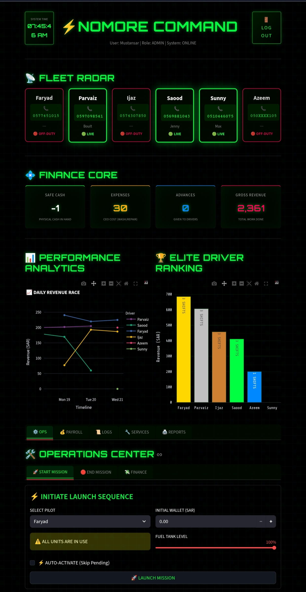

# 🚀 Riyadh Fleet Manager (Titan Log Master)

**A comprehensive, digital fleet management solution designed to automate driver tracking, financial calculations, and operational workflows.**

---

## 📸 Dashboard Preview

---

## 🌟 Project Overview

**Titan Log Master** is a custom-built software tailored for fleet businesses in Saudi Arabia. It replaces manual paper logs with a secure, real-time digital system. It bridges the gap between **Drivers**, **Managers (Admin)**, and **Investors (CEO)** by providing transparency and automation.

### 💡 Key Problems Solved:
* ❌ Eliminated manual calculation errors in salaries and expenses.
* ❌ Stopped unauthorized vehicle usage and time theft.
* ❌ Removed confusion regarding traffic fines (Saher) and driver liability.

---

## 🛠️ Key Features

### 1. 📡 Live Fleet Radar
* Real-time status of all drivers (**Active** vs **Off-Duty**).
* Visual indicators for vehicle assignment.

### 2. 💰 Automated Financial Core
* **Target-Based Salary:** Automatically calculates salary based on the monthly target (e.g., 6000 SAR Target = 2000 SAR Salary). Pro-rata calculations for lower revenue.
* **Auto-Deductions:** Traffic fines (Challans) and Advances are automatically deducted from the driver's net payable salary.
* **Net Profit View:** Calculates pure profit after deducting Fuel and Maintenance costs.

### 3. 🔐 Role-Based Access Control (RBAC)
* **👨‍✈️ Driver Mode:** Simple interface to Start/End shifts and log cash handover.
* **🛠️ Admin Mode (Manager):** Full control to Approve/Reject shifts, manage finances, and add expenses.
* **👑 CEO Mode (View mode):** A "Read-Only" high-level dashboard to monitor business health, revenue, and leaderboards without edit access.

### 4. 📊 Analytics & Reporting
* **Neon Analytics:** Interactive graphs showing daily revenue trends.
* **Elite Leaderboard:** Ranks drivers based on performance and shifts.
* **Auto-Receipts:** Generates professional PNG receipts for every shift and salary report.

---

## 💻 Tech Stack

* **Language:** Python
* **Framework:** Streamlit (Web App)
* **Database:** Google Sheets API (NoSQL-like structure, real-time sync)
* **Data Processing:** Pandas
* **Visualization:** Plotly Express & Graph Objects
* **Styling:** Custom CSS (Cyberpunk/Hacker Theme)

---

## 🚀 How It Works

1.  **Shift Start:** Driver logs in and clicks "Start Mission". The system records the exact timestamp (Riyadh Time).
2.  **Operations:** Admin monitors active drivers via the Fleet Radar.
3.  **Shift End:** Driver enters total cash collected and fuel expenses.
4.  **Verification:** Admin receives a notification to **Approve** or **Reject** the log.
5.  **Analytics:** Upon approval, data is pushed to the main database, updating the CEO's financial dashboard instantly.

---

## 👨‍💻 Developer

**Mustansar**
*Full Stack Developer & System Architect*

> "I build digital solutions that turn chaos into control."

[🌐 Visit GitHub Profile](https://github.com/mustansar840)

---
*© 2026 Riyadh Fleet Manager. All Rights Reserved.*

